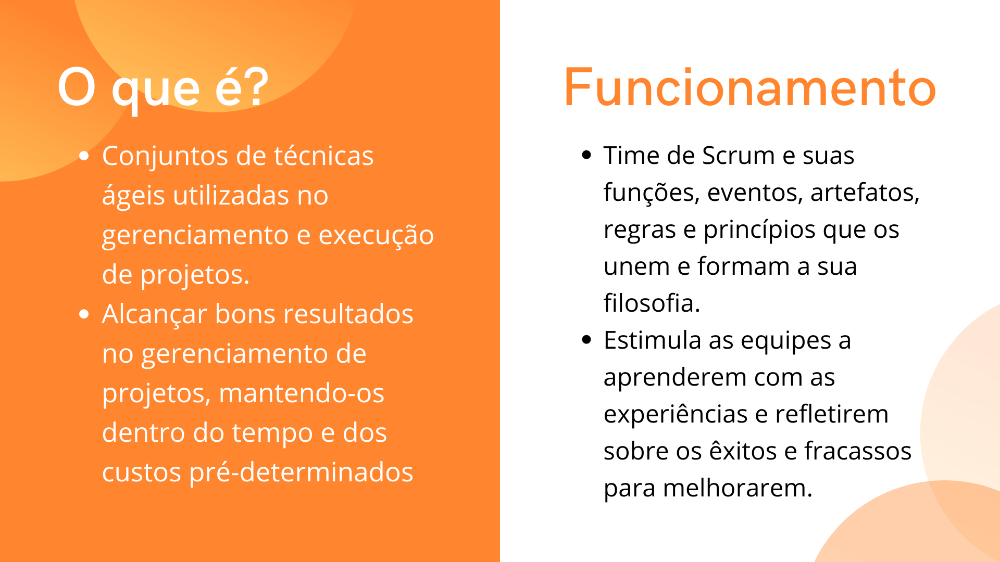
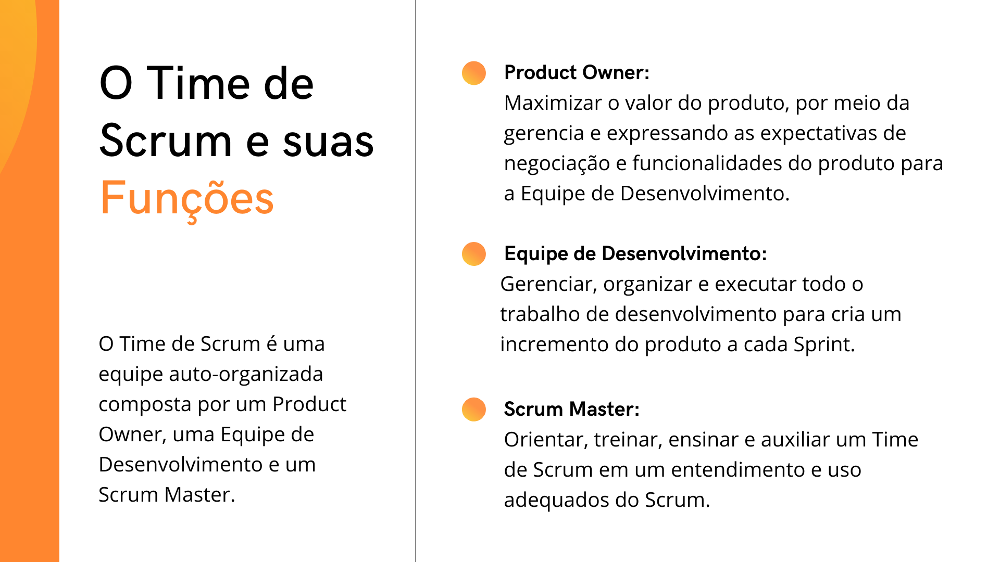
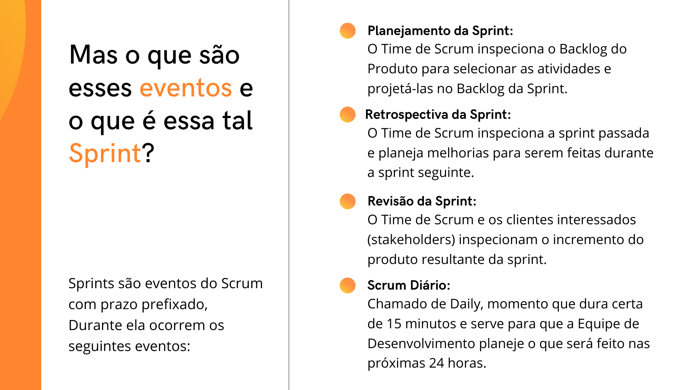
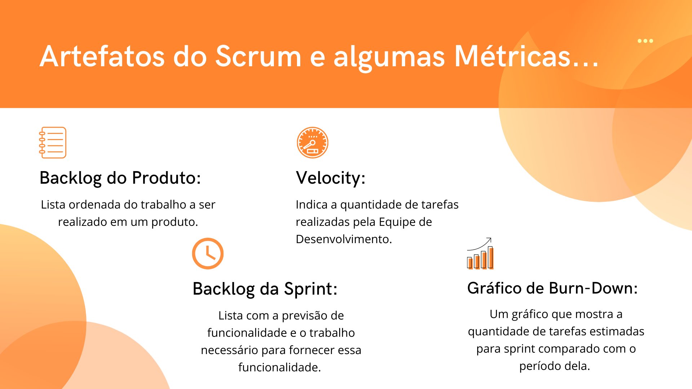
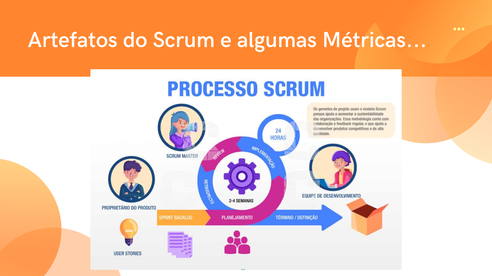
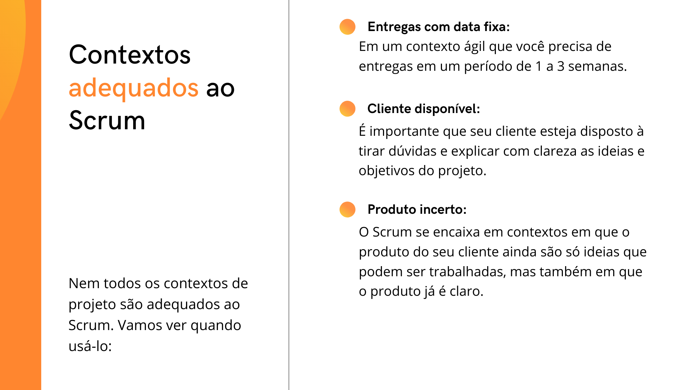
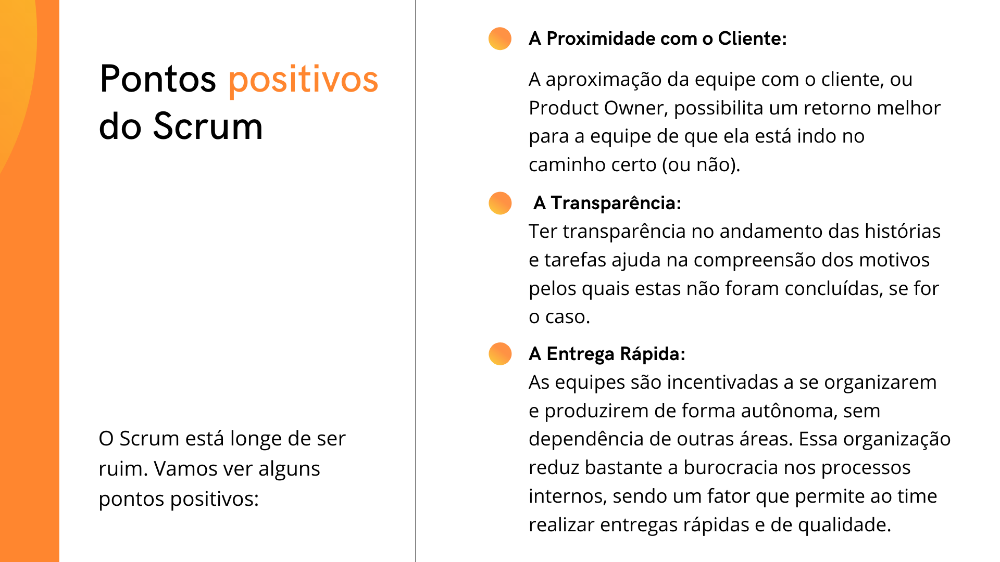
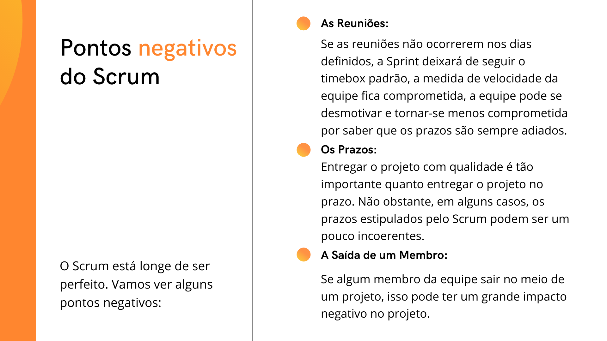

<h1 align="center"> Material do Seminário - Scrum </h1>
<h2 align="center"> Unidade 1 </h2>

1. ### _**Scrum**_

    

2. ### _**O que é e como é o seu funcionamento:**_

    

3. ### _**O Time de Scrum e suas Funções**_

    

4. ### _**Mas o que são esses eventos e o que é essa tal Sprint?**_

    

5. ### _**Artefatos do Scrum e algumas Métricas...**_

    

6. ### _**Artefatos do Scrum e algumas Métricas...**_

    

7. ### _**Princípios Ágeis**_

    

8. ### _**Contextos adequados ao Scrum**_

    

9. ### _**Pontos positivos do Scrum**_

    

10. ### _**Pontos negativos do Scrum**_

    

11. ### _**Scrum Guide**_

    

12. ### _**Orc'estra Gamificação**_

    
